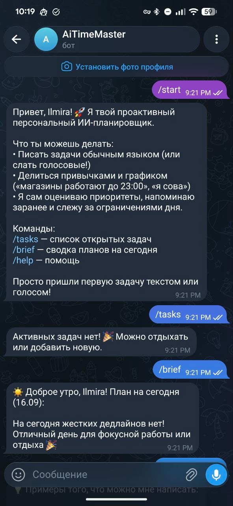
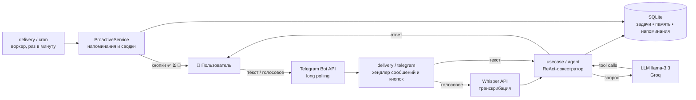

<div align="center">

# 🤖 Proactive AI Planner Bot

**Личный планировщик в Telegram, управляемый ИИ-агентом:**
говоришь текстом или голосом — агент сам создаёт, переносит и напоминает о задачах,
учитывая то, что знает о тебе.

[](https://go.dev)
[](#-как-думает-агент)
[](#-быстрый-старт)
[](https://modernc.org/sqlite)
[](#-тесты)
[](./LICENSE)



</div>

---

## 💡 Зачем этот проект

Задачи копились в заметках и в голове: дедлайны пропускались, а большие задачи висели
неделями, потому что непонятно, с чего начать. Вместо очередного todo-списка я собрала
своего планировщика — такого, который понимает естественную речь, запоминает контекст
и сам следит за дедлайнами.

Проект начался с парсера дат на регулярках, а затем эволюционировал в полноценного
ИИ-агента с инструментами — обе версии в истории коммитов показывают этот путь.

Проект спроектирован и собран **в паре с ИИ-агентами**: рутинную реализацию агенты
ускоряют в разы, но архитектурные решения, код-ревью и финальная ответственность — мои.
Это мой обычный рабочий режим.

## 🌟 Ключевые особенности

- 🧠 **Полноценный AI-агент (ReAct + Function Calling):** никаких жёстких скриптовых веток —
  агент сам извлекает сущности, решает, какие инструменты вызвать (`create_task`,
  `reschedule_task`, `complete_task`, `list_tasks`, `save_user_fact`), и формирует
  человечный ответ. За одно сообщение может создать задачу, перенести старую и
  записать факт в память.

- 💾 **Долговременная память о пользователе:** бот накапливает контекст из обычных
  диалогов — «я сова», «магазины у дома до 23:00», «по вторникам зал» — и опирается
  на него при приоритизации и напоминаниях.

- 🎙 **Голосовой ввод (Voice-to-Agent):** надиктуй задачу на бегу — Whisper расшифрует
  и сразу передаст в агентный цикл.

- ⏰ **Проактивность вместо будильника:** фоновый воркер анализирует дедлайны и внешние
  ограничения; если вечером висит задача на покупки, а магазины скоро закроются —
  бот предупредит. Ночной режим уважается через «тихие часы» (Quiet Hours).

- 🔘 **Инлайн-кнопки:** к каждому напоминанию — `[✅ Сделано]` `[⏳ +1 час]` `[🌙 На завтра]`.

- 🔒 **Приватный доступ:** изоляция данных пользователей в SQLite (FK, каскады,
  транзакции), белый список `PLANNER_ALLOWED_USERS`.

## 🗣 Примеры диалогов

```text
👤 (голосом): «Слушай, напомни завтра в 15:00 созвониться с тимлидом
               по архитектуре, и ещё надо забрать посылку до пятницы»

🤖 🎙 Вы сказали: «Слушай, напомни завтра в 15:00 созвониться…»
   Зафиксировал две задачи:
   1. 📞 Созвониться с тимлидом по архитектуре — завтра 15:00 (high)
   2. 📦 Забрать посылку — до пятницы (medium)
```

```text
👤 «Кстати, наш пункт выдачи закрывается в 20:00,
    а продуктовый работает до 23:00»

🤖 Запомнил! Зафиксировал часы работы в профиле:
   • Пункт выдачи: до 20:00
   • Продуктовый: до 23:00
   Буду учитывать это при вечерних напоминаниях!
```

## 🧠 Как думает агент

Каждое сообщение (текст или расшифрованное голосовое) попадает в **ReAct-цикл**:
модель анализирует запрос → решает, какие инструменты вызвать → получает их результаты
→ формирует человечный ответ. До 4 итераций на сообщение; ошибка инструмента
возвращается модели как JSON — она корректируется, а бот не падает.

| Инструмент | Что делает |
|---|---|
| `create_task` | создаёт задачу: дедлайн, категория, приоритет, длительность, ограничения |
| `reschedule_task` | переносит дедлайн по ID или названию, запоминает причину |
| `complete_task` | закрывает задачу |
| `list_tasks` | возвращает активные задачи — агент сверяется с расписанием |
| `save_user_fact` | сохраняет факт о пользователе в долговременную память |

## 🏛 Архитектура



Clean Architecture: домен в центре, зависимости направлены снаружу внутрь.

```
main.go                  # точка входа: сборка, DI, graceful shutdown
internal/domain          # сущности (Task, User, UserFact, Reminder) и порты — 0 зависимостей
internal/usecase/agent   # ReAct-оркестратор + JSON Schema инструментов
internal/usecase         # ProactiveService: риски дня, напоминания, утренняя сводка
internal/adapter         # telegram, llm (function calling), whisper, sqlite (pure Go)
internal/delivery        # telegram-хендлер и cron-воркер
pkg/dateparse            # парсер русских дат на регулярках (первая версия проекта) + тесты
```

## 🚀 Быстрый старт

```bash
cp .env.example .env    # заполни токен бота, ключ LLM и свой telegram id
go run .
```

| Переменная | Описание | По умолчанию |
|---|---|---|
| `PLANNER_TOKEN` | токен бота от [@BotFather](https://t.me/BotFather) (обязательно) | — |
| `PLANNER_API_KEY` | ключ OpenAI-совместимого API (LLM + Whisper) — [Groq](https://console.groq.com) / [OpenRouter](https://openrouter.ai) | — |
| `PLANNER_BASE_URL` | эндпоинт провайдера | `https://api.groq.com/openai/v1` |
| `PLANNER_MODEL` | модель с function calling | `llama-3.3-70b-versatile` |
| `PLANNER_WHISPER_MODEL` | модель транскрибации голосовых | `whisper-large-v3` |
| `PLANNER_ALLOWED_USERS` | telegram id через запятую — приватный режим | открыт для всех |
| `PLANNER_DB_PATH` | путь к базе SQLite | `planner.db` |
| `PLANNER_TELEGRAM_PROXY` | HTTP-прокси до api.telegram.org, если недоступен напрямую | — |


## 🧪 Тесты

```bash
go test ./...    # репозитории SQLite (in-memory) + парсер дат
```

## 🛠 Инженерные задачи, решённые по пути

- **Кириллица и `\b`** — граница слова в Go-регулярках определена только для ASCII:
  «через» и «в» с `\b` вообще не находятся. Границы проверяются вручную через
  `unicode.IsLetter` (`pkg/dateparse`, покрыт тестами)
- **Один токен — один бот** — два экземпляра long polling конфликтуют (409 Conflict);
  ошибка ловится и логируется понятно
- **Деградация вместо падения** — LLM недоступен → вежливое сообщение, бот живёт;
  лимит итераций агента защищает от зацикливания
- **Pure-Go SQLite** (`modernc.org/sqlite`) — единственная зависимость проекта,
  кросс-компиляция без CGo
- **Тихие часы в домене** — правило «не будить ночью» живёт в `domain.User.InQuietHours()`,
  а не размазано по коду

## 🗺 Идеи развития

- предложить свободный слот под задачу («когда вставить спорт?»)
- повторяющиеся задачи («каждую пятницу отчёт»)
- несколько пользователей с разными таймзонами — модель данных уже готова

## 👤 Автор

**Ильмира Насырова** · [Telegram @il_mira7](https://t.me/il_mira7) · [GitHub @il-mira7](https://github.com/il-mira7)

## 📄 Лицензия

[MIT](./LICENSE)
